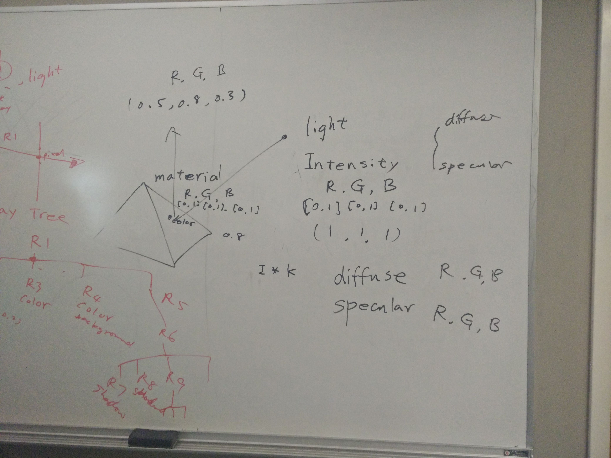
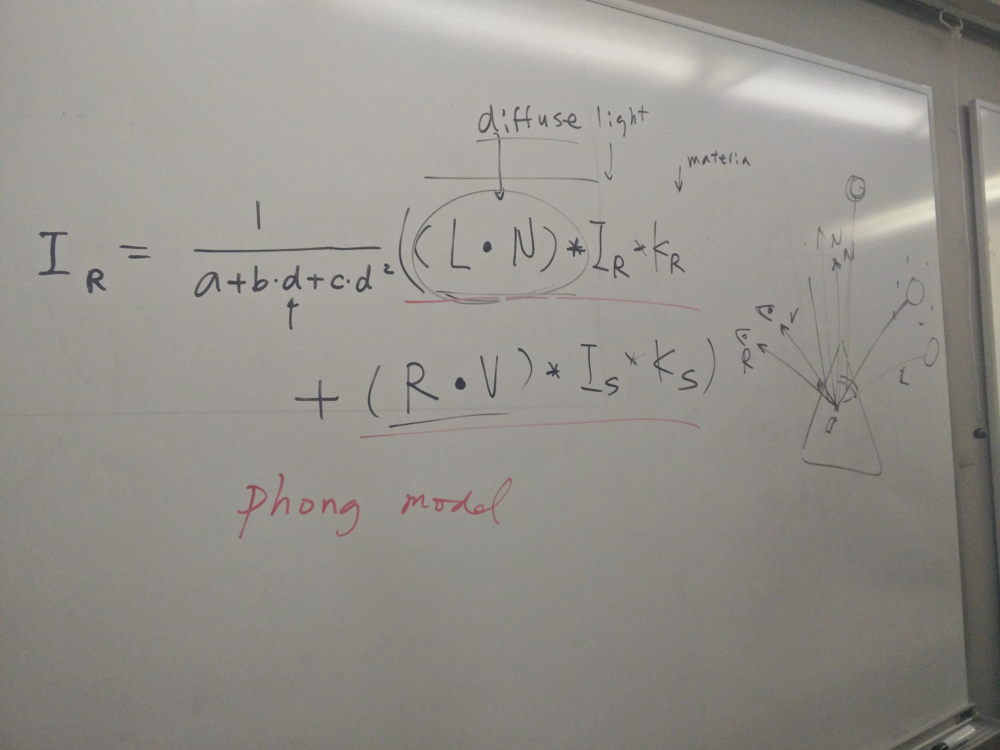
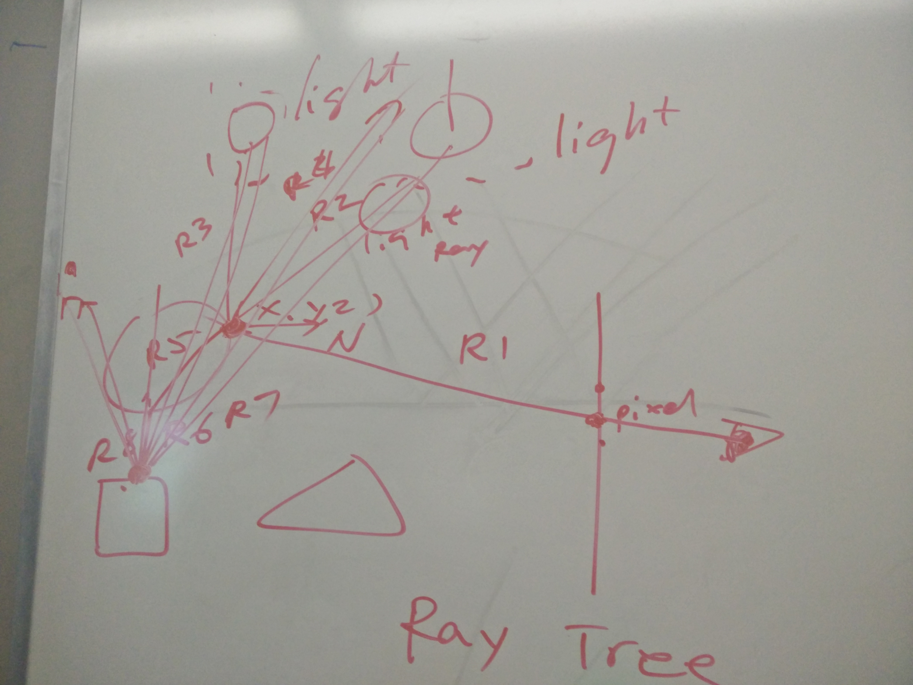
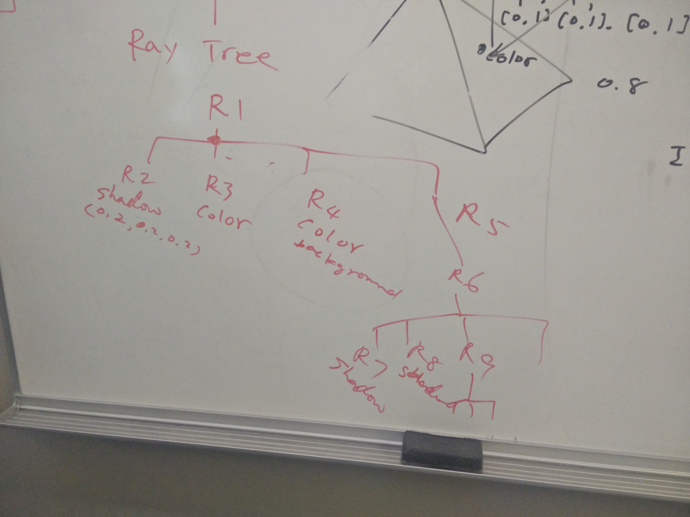

# How Light is calculated (sort of)

Lighting occurs due to mainly these factors:
- Intensity (R,G,B)
- Diffuse (R,G,B)
- Specular (R,G,B)

Intensity is calculated upon the diffuse and specular.

And is a combination of the material and light components.

## One way (Phong model)

Phong Model of calculating color of pixels: (dot product)

Ir = (1/a+b*d+c*d^2) ((L*N) * Im x Km) + ( R * V) * Is x Ks))

- Ir = Intensity of the reflection for a pixel
- d = distance
- (L*N) = expression representing diffuse light
- Im and Km are the material
- R * V is the angle of the light relative to the vertex
- Is and Ks are the specular light

## Realtime way

With raycasting, we can build a tree of light rays that hit objects, find the relations between them and decide what the color of the pixels will be.

R1 from light source to object, splits to r2 that becomes a shadow connecting the object back to the light source, r3, r4, r5 (do I hit you...do I hit you...do I hit you...) hits all other objects in the scene and generate their own rays (including shadow and other rays).

Add colors from the bottom of the tree until you get to the root. That color value will be the color of the pixel.

Can control the number of rays specifying the number of times a ray bounces. Normally done by telling rays to bounce 500 times, only going layers deep in the ray tree, or other methods.

It is very expensive to raytrace, but it can be done in parallel which is what a lot of companies use.
